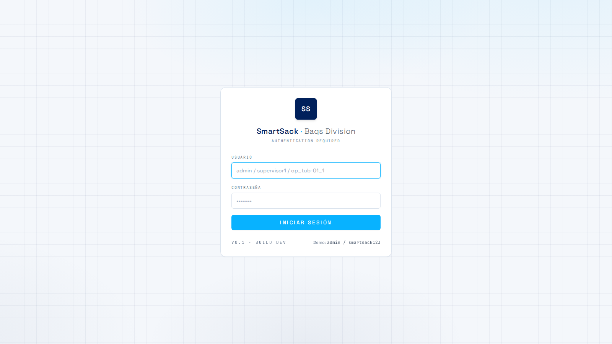
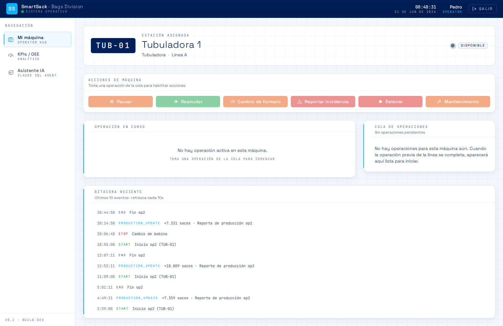
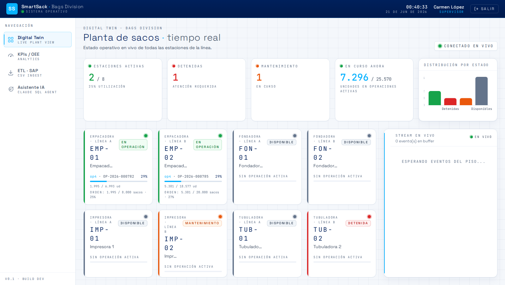
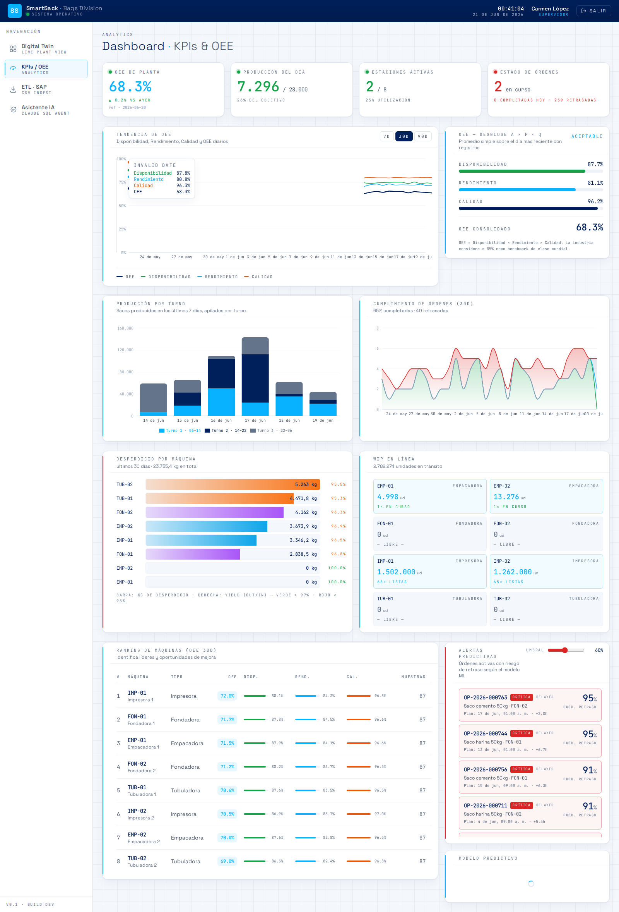
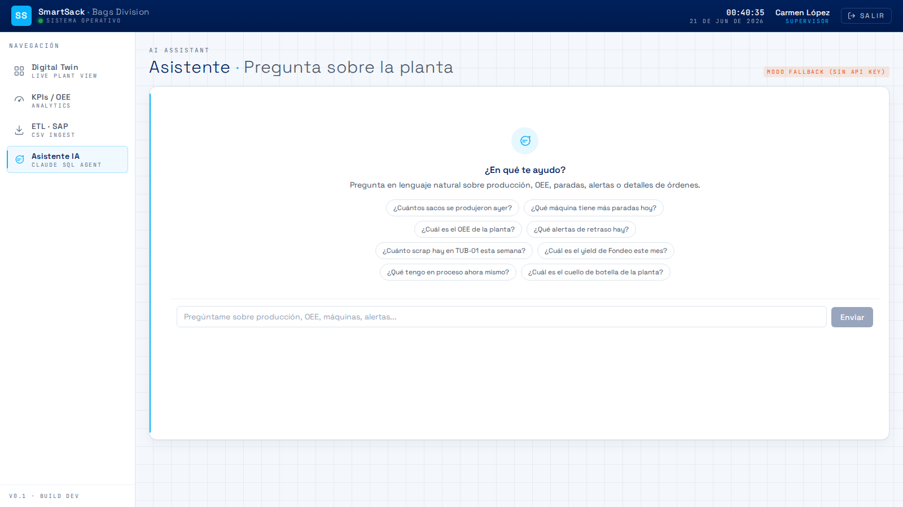
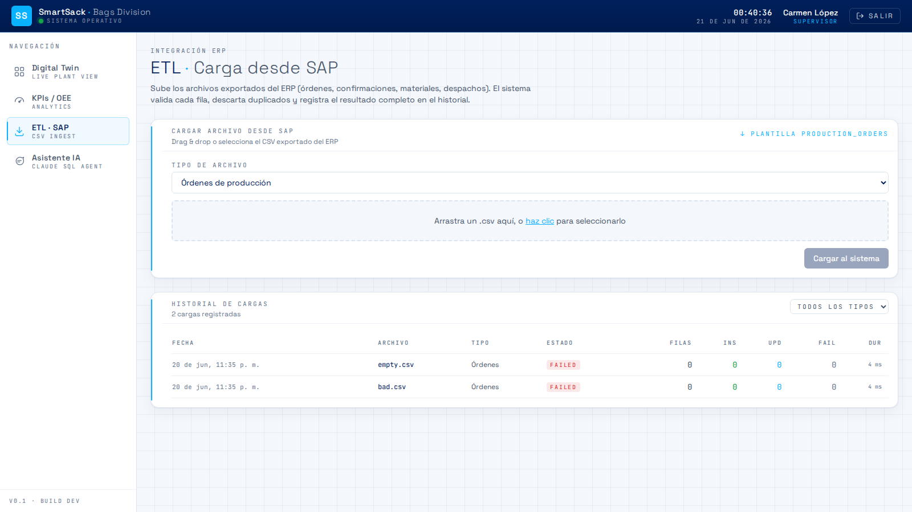
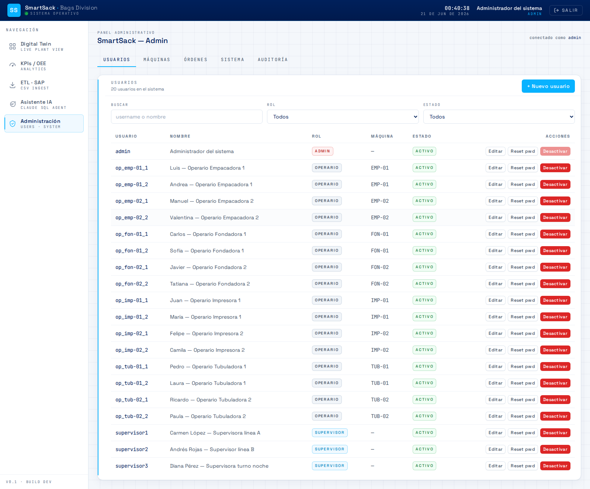

# Manual de usuario — SmartSack

**Proyecto:** SmartSack · **Entregable:** E8 · **Audiencia:** operarios,
supervisores y administradores de planta

Guía de uso de la plataforma SmartSack para el día a día en el piso de
producción.

---

## 1. ¿Qué es SmartSack?

SmartSack es una plataforma web que complementa el ERP de la planta y muestra,
en tiempo real y en lenguaje claro, el estado de la producción de sacos de
papel. Permite a cada persona ver lo que necesita según su rol, registrar lo que
ocurre en las máquinas y consultar información sin tener que llamar por teléfono
ni recorrer la planta.

Se usa desde el navegador web, en los mismos equipos que ya hay en planta. No
requiere instalar nada.

## 2. Acceso al sistema

1. Abra el navegador en la dirección de SmartSack (por defecto **http://localhost**
   o la que indique el área técnica).
2. Ingrese su **usuario** y **contraseña**.
3. El sistema lo llevará automáticamente a la vista correspondiente a su rol.

**Usuarios de demostración** (contraseña `smartsack123`):

| Usuario | Rol |
|---|---|
| `admin` | Administrador |
| `supervisor1` | Supervisor |
| `op_imp-01_1` | Operario (Impresora 1) |

Para **cerrar sesión**, use el botón de salida en la barra superior.

## 3. Roles y qué puede hacer cada uno

| Rol | Acceso |
|---|---|
| **Operario** | Vista de su máquina y registro de eventos. |
| **Supervisor** | Digital Twin de toda la planta, dashboard de KPIs, carga de datos. |
| **Administrador** | Todo lo anterior + administración de usuarios, máquinas y órdenes. |

## 4. Vista de operario

Es la pantalla principal del operario. Muestra el estado de **su** máquina y le
permite registrar lo que sucede.

### 4.1. Estado de la máquina y operación en curso

- **Tarjeta de estado:** indica si la máquina está *en marcha*, *detenida*, *en
  mantenimiento* o *libre*, mediante colores.
- **Operación en curso:** muestra la orden que se está fabricando, su avance y
  las cantidades. Desde aquí puede **reportar la producción** alcanzada y
  **finalizar la operación** cuando termina.

### 4.2. Botones de acción rápida

Según el estado de la máquina, aparecen distintas acciones. Al pulsarlas, el
sistema puede pedir una breve descripción:

| Acción | Cuándo aparece | Qué hace |
|---|---|---|
| **Pausar** | Máquina en marcha | Registra una pausa temporal. |
| **Reanudar** | Máquina detenida o en mantenimiento | Vuelve a poner la máquina en marcha. |
| **Cambio de formato** | Máquina en marcha | Registra un cambio de formato (pide describirlo). |
| **Reportar incidencia** | En marcha o detenida | Registra una incidencia (pide indicar qué ocurrió). |
| **Detener** | Máquina en marcha | Registra una parada (pide el motivo). |
| **Mantenimiento** | Máquina en marcha | Registra mantenimiento (pide el tipo). |

Cada registro confirma con un mensaje (p. ej. *"Detener registrado · #123"*) y
se notifica en el acto a los supervisores.

### 4.3. Eventos recientes y cola de trabajo

- **Eventos recientes:** historial de las últimas acciones de la máquina.
- **Cola de operaciones:** las operaciones pendientes y listas para iniciar en
  su máquina, en orden.

## 5. Vista de supervisor — Digital Twin

El supervisor ve el **mapa completo de la planta**: las dos líneas (A y B) con
sus máquinas en secuencia (Impresora → Tubuladora → Fondadora → Empacadora).

- Cada máquina aparece **codificada por color** según su estado (en marcha,
  detenida, mantenimiento, libre).
- La vista se **actualiza en tiempo real**: cuando un operario registra una
  parada o incidencia, el cambio se refleja de inmediato sin recargar la página.
- Permite identificar de un vistazo dónde hay un problema y qué orden está en
  cada máquina.

## 6. Dashboard de KPIs y OEE

Panel de indicadores de gestión, disponible para supervisores y administradores:

- **OEE** (Disponibilidad × Rendimiento × Calidad) de la planta y por máquina.
- **Cumplimiento** y volúmenes de producción.
- **Órdenes retrasadas** y **alertas de retraso** generadas por el motor de
  predicción (resaltadas cuando hay riesgo).
- Tendencias y gráficas históricas.

## 7. Asistente conversacional

SmartSack incluye un **chatbot** que responde preguntas sobre la producción en
lenguaje natural. Escriba su pregunta en el cuadro de texto y pulse enviar.

Ejemplos de preguntas que entiende:

- *¿Cuántos sacos se produjeron ayer?*
- *¿Qué máquina tiene más paradas hoy?*
- *¿Cuál es el OEE de la planta?*
- *¿Qué alertas de retraso hay?*
- *¿Cuánto scrap hay en TUB-01 esta semana?*
- *¿Cuál es el cuello de botella de la planta?*
- *¿Qué tengo en proceso ahora mismo?*

El asistente consulta la base de datos en el momento y responde con datos
reales. (Si el área técnica no ha configurado la clave de IA, el asistente
seguirá respondiendo las preguntas frecuentes mediante palabras clave.)

## 8. Trazabilidad de una orden

Al seleccionar una orden, la vista de trazabilidad muestra su recorrido completo
por las cuatro máquinas de la línea: tiempos, cantidades producidas, desperdicio
y eventos asociados a cada etapa. Útil para auditar qué pasó con un lote
concreto.

## 9. Carga de datos del ERP (ETL)

Supervisores y administradores pueden **cargar archivos CSV** exportados del ERP
(órdenes, confirmaciones, materiales, despachos) desde la sección de carga de
datos:

1. Seleccione el tipo de archivo y el CSV correspondiente.
2. Suba el archivo.
3. El sistema valida los datos e informa cuántos registros se cargaron y si hubo
   filas con errores (con el detalle de cada una).

## 10. Administración (solo administrador)

El panel de administración permite gestionar:

- **Usuarios:** crear, editar y asignar roles y máquinas.
- **Máquinas:** alta, edición y estado de las máquinas de la planta.
- **Órdenes:** consulta y gestión de órdenes de producción.
- **Auditoría:** registro de acciones realizadas en el sistema.
- **Sistema:** información y parámetros generales.

## 11. Preguntas frecuentes

**No veo el botón que necesito.** Las acciones dependen del estado de la máquina
y de su rol; por ejemplo, *Reanudar* solo aparece si la máquina está detenida.

**Mi sesión se cerró sola.** Por seguridad, la sesión caduca tras un tiempo de
inactividad; vuelva a iniciar sesión.

**El supervisor no ve mi cambio.** Verifique su conexión de red: la
actualización en tiempo real requiere conexión activa con el servidor.

**¿A quién acudo ante un problema técnico?** Consulte el
[Manual técnico](./Manual_Tecnico.md) o contacte al área de sistemas.
